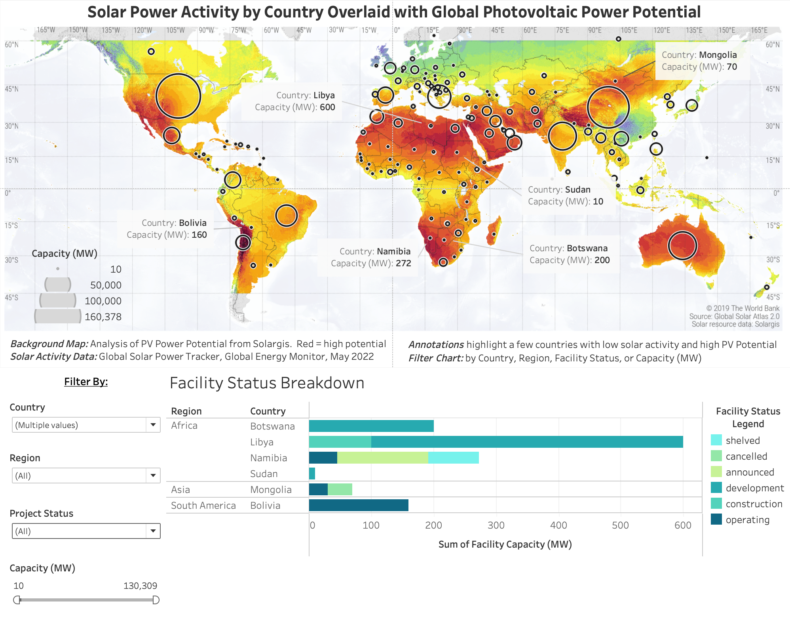
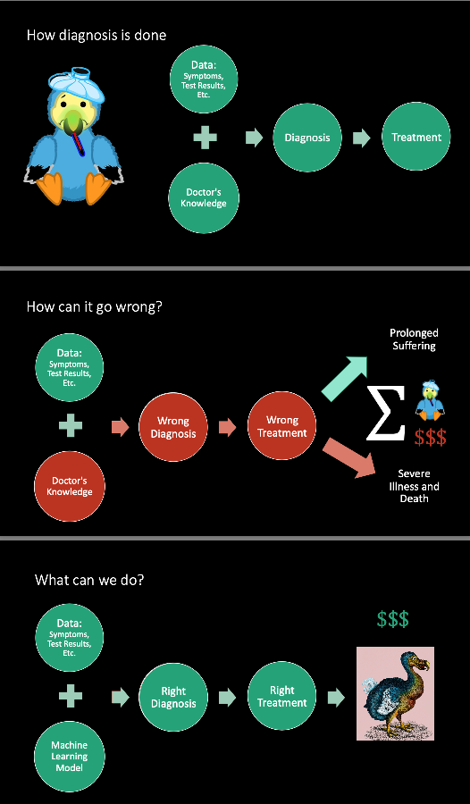

My recent data science and analytics projects:

## Project 1: [Global Solar Analysis Tableau Dashboard](https://public.tableau.com/app/profile/caitlin.ortega.ruble/viz/GlobalSolarAnalysis/GlobalDashboard?publish=yes)
A project which overlays global solar power generation capacity data on a background map which shows photovoltaic power potential. The dashboard is intended to be used as a tool for solar businesses assessing international market potential based on where solar power is and isn't being used along with which locations have the greatest potential.

And, the storydeck to explain can be found [here:](https://public.tableau.com/shared/HSKRG97S6?:display_count=n&:origin=viz_share_link)

## Project 2: [Patient Diagnosis with Machine Learning](https://github.com/caitlinruble/Patient-Diagnosis-Project)
#A multiclass classification problem: given a patient's symptoms, can a machine learning model sucessfully give a diagnosis? 

Python tools: Pandas, Scikit Learn, XGBoost, Random Forest, AdaBoost, SVM, GridSearchCV, RandomSearchCV, Matplotlib, Seaborn, Predictive Power Score, Feature Importances

## Project 3: Skin Cancer Image Detection:

Coming soon!

## [Springboard Work](https://github.com/caitlinruble/Springboard-Work):

Some selected work from my 550hr+ data science intensive course
